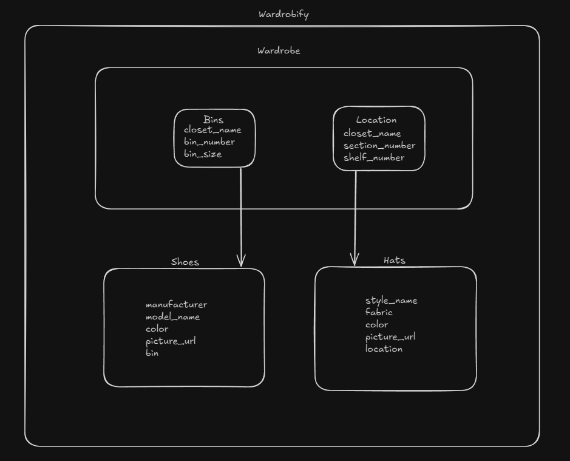

# Wardrobify

<!-- Improved compatibility of back to top link: See: https://github.com/othneildrew/Best-README-Template/pull/73 -->
<a id="readme-top"></a>

<!-- PROJECT LOGO -->
<br />
<div align="center">
  <a href="https://www.toxel.com/wp-content/uploads/2023/12/crocshat05.jpg">
    
  </a>

<h3 align="center">Wardrobify</h3>

  <p align="center">
    This project is an app that helps people with large wardrobes organize their hats and shoes, using RESTful APIs and a React front-end.
    <br />
  </p>
</div>


<!-- TABLE OF CONTENTS -->
<details>
  <summary>Table of Contents</summary>
  <ol>
    <li>
      <a href="#about-the-project">About The Project</a>
      <ul>
        <li><a href="#team">Team</a></li>
        <li><a href="#shoes-microservice">Shoes microservice</a></li>
        <li><a href="#hats-microservice">Hats microservice</a></li>
        <li><a href="#built-with">Built With</a></li>
      </ul>
    </li>
    <li>
      <a href="#getting-started">Getting Started</a>
      <ul>
        <li><a href="#prerequisites">Prerequisites</a></li>
        <li><a href="#installation">Installation</a></li>
      </ul>
    </li>
    <li><a href="#usage">Usage</a></li>
    <li><a href="#diagram-of-project">Diagram of Project</a></li>
    <li><a href="#contact">Contact</a></li>
    <li><a href="#acknowledgments">Acknowledgments</a></li>
  </ol>
</details>


<!-- ABOUT THE PROJECT -->
## About The Project

Wardrobify is an app that lets you keep track of your hats and shoes if you have a large wardrobe. It’s built with microservices and uses RESTful APIs and React. This project is a great way to practice building and connecting microservices, working with PostgreSQL, and developing with React.

### Team

* Jen Wong- Shoes microservice
* Rachel McReynolds- Hats microservice

### Shoes microservice

Explain your models and integration with the wardrobe
microservice, here.

The Shoes microservice handles everything related to shoes in the Wardrobify app. It has two main models: Shoes and BinVO. Shoes model stores the shoe details, like manufacturer, model, color, and picture. Each shoe is linked to a BinVO, which tells us where the shoe is stored. BinVO gets its data from the Wardrobe microservice, making sure everything stays up-to-date.

### Hats microservice

Explain your models and integration with the wardrobe
microservice, here.

The Hats microservice manages all the hat-related data. It uses the Hats model to store details like style, fabric, color, and picture. Each hat is connected to a specific spot in the wardrobe, represented by the LocationVO model. Like with shoes, the LocationVO data stays synced with the Wardrobe microservice.

<p align="right">(<a href="#readme-top">back to top</a>)</p>

### Built With

* Django 4.0.3
* React
* Bootstrap
* Python 3.10
* PostgreSQL
* Docker

<p align="right">(<a href="#readme-top">back to top</a>)</p>


<!-- GETTING STARTED -->
## Getting Started

Here’s how to get started with Wardrobify:

### Prerequisites

* Docker - Install and run Docker
* Git - Fork and clone the project repository, and use Git for version control

### Installation

1. Fork and clone the repo
   ```sh
   git clone https://gitlab.com/jmw520/microservice-two-shot.git
   ```

<p align="right">(<a href="#readme-top">back to top</a>)</p>


<!-- USAGE EXAMPLES -->
## Usage

Use this space to show useful examples of how a project can be used. Additional screenshots, code examples and demos work well in this space. You may also link to more resources.

For the everyday app user:

* Home Organization: Categorize and locate your hats and shoes in your closets.
* Inventory Management: Track collections of hats and shoes.
* Assemble Outfits: Put together outfits by browsing items in your wardrobe.

For other coders:

* Learning Resource: Learn how to build apps with microservices, RESTful APIs, and React.
* Customization: Fork the project and tweak it to suit different items or add new features.
* API Integration: Use the project’s API setup to build other organized data management tools.
* Contribution: Contribute to the project by adding features, fixing bugs, or improving performance.

<p align="right">(<a href="#readme-top">back to top</a>)</p>


<!-- ROADMAP -->
## Diagram of Project


<p align="right">(<a href="#readme-top">back to top</a>)</p>


<!-- CONTACT -->
## Contact

Jen and Rachel - You can find us in the MayPT cohort.

Project Link: [https://gitlab.com/jmw520/microservice-two-shot](https://gitlab.com/jmw520/microservice-two-shot)

<p align="right">(<a href="#readme-top">back to top</a>)</p>


<!-- ACKNOWLEDGMENTS -->
## Acknowledgments

* Paul Nnaoji
* Daniel Brainich
* Brittany Baker
* All our MayPT Cohort Colleagues

<p align="right">(<a href="#readme-top">back to top</a>)</p>
